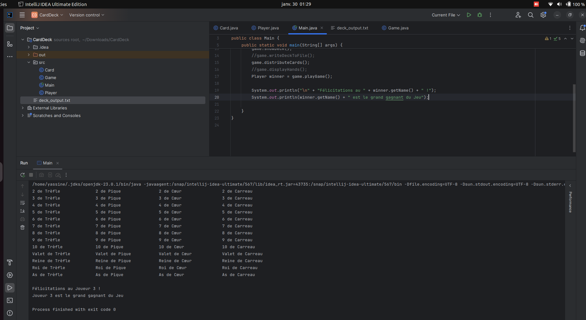
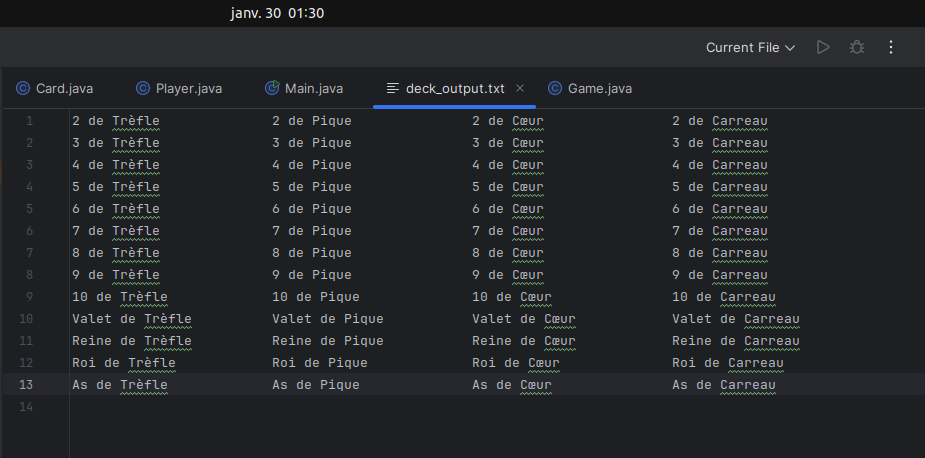

# cardDeck

Le projet **CardDeck** est une application Java permettant de jouer avec un paquet de 52 cartes, chacune ayant une valeur et une couleur. Le jeu peut être joué par 4 joueurs.

L'image ci-dessous montre le résultat de l'exécution de la méthode `showDeck()`. Cette méthode permet d'afficher les cartes d'un paquet en les regroupant par couleur (Trèfle, Pique, Cœur, Carreau) dans un format structuré.  

L'image ci-dessous montre le résultat de l'exécution de la méthode `writeDeckToFile()`. Cette méthode permet d'écrire les cartes du paquet dans un fichier texte appelé `deck_output.txt`.  

